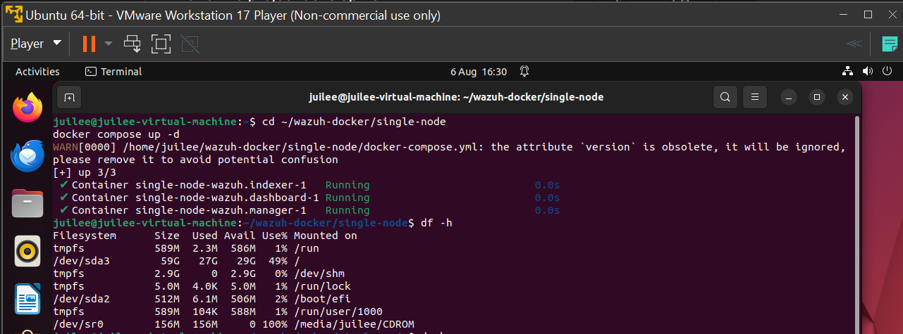
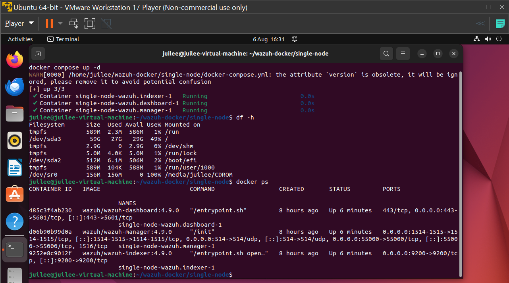

# Phase 1: Environment Setup

## Overview
This SOC lab simulates a small-scale Security Operations Center using three virtual machines on a single host laptop (Windows, 16GB RAM), managed with VMware Workstation 17 Player.

## Lab Architecture

| VM | Role | OS | RAM | Purpose |
|---|---|---|---|---|
| SOC Server | Detection & monitoring backend | Ubuntu Server 22.04 LTS | 6GB | Runs Wazuh + Elastic Stack (via Docker) |
| Attacker | Threat simulation | Kali Linux 2025.1 | 2GB | Launches attack simulations against the victim |
| Victim | Monitored target | Metasploitable2 | 512MB | Intentionally vulnerable system that generates real attack telemetry |

All three VMs run on the same virtual network (bridged), allowing them to communicate as if on a shared LAN.

## Why this setup
This mirrors the minimum components of a real SOC:
- A central monitoring/detection platform (SOC server)
- A source of malicious activity to detect (attacker)
- A monitored asset that could realistically be compromised (victim)

Using Metasploitable2 and Kali instead of a Windows victim kept the lab lightweight and avoided a large Windows ISO download, while still providing a realistic, intentionally vulnerable target.

## Setup steps

1. **Hypervisor**: VMware Workstation 17 Player (non-commercial use), already installed
2. **SOC server VM**: Ubuntu Server 22.04.3 LTS ("jammy"), initially provisioned with a 20GB virtual disk and 4GB RAM
3. **Networking verification**: Confirmed internet access inside the Ubuntu VM. Hit an initial DNS resolution failure:
```
ping: google.com: Temporary failure in name resolution
```
Direct IP pings (`ping -c 4 8.8.8.8`) succeeded, confirming raw connectivity was fine and the issue was DNS-specific. Resolved by restarting the DNS resolver service:
```bash
   sudo systemctl restart systemd-resolved
```
4. **Docker installation**: Installed Docker Engine and Docker Compose plugin via Docker's official APT repository:
```bash
   sudo apt update
   sudo apt install -y ca-certificates curl gnupg

   sudo install -m 0755 -d /etc/apt/keyrings
   curl -fsSL https://download.docker.com/linux/ubuntu/gpg | sudo gpg --dearmor -o /etc/apt/keyrings/docker.gpg
   sudo chmod a+r /etc/apt/keyrings/docker.gpg

   echo \
     "deb [arch=$(dpkg --print-architecture) signed-by=/etc/apt/keyrings/docker.gpg] https://download.docker.com/linux/ubuntu \
     $(. /etc/os-release && echo "$VERSION_CODENAME") stable" | \
     sudo tee /etc/apt/sources.list.d/docker.list > /dev/null

   sudo apt update
   sudo apt install -y docker-ce docker-ce-cli containerd.io docker-buildx-plugin docker-compose-plugin
```
   Verified with:
```bash
   docker run hello-world
```

## Issue encountered: apt lock during install

**Problem**: `apt install` repeatedly failed with `Could not get lock /var/lib/dpkg/lock-frontend`.

**Diagnosis**: Ubuntu's built-in `unattended-upgrades` background service was mid-update and holding the package manager lock. `ps aux` showed the process running at 98% CPU for 15+ minutes without releasing it.

**Fix**: Safely terminated the stuck process and cleared stale locks:
```bash
sudo kill -9 <pid>
sudo rm -f /var/lib/dpkg/lock-frontend /var/lib/dpkg/lock /var/cache/apt/archives/lock
sudo dpkg --configure -a
```

## Issue encountered: undersized virtual disk

**Problem**: The initial 20GB virtual disk was too small for the Wazuh + Elastic Stack container images, which require roughly 40-50GB combined for images, volumes, and data.

**Diagnosis**: `df -h` showed `/dev/sda3` at 97% capacity (18GB of 20GB used) before Wazuh had even finished downloading, causing the deployment to fail partway through with disk write errors.

**Fix**:
1. Powered off the VM
2. Expanded the virtual disk in VMware Workstation settings from 20GB → 60GB
3. Extended the Linux partition into the new space and grew the filesystem:
```bash
   sudo growpart /dev/sda 3
   sudo resize2fs /dev/sda3
```

**Result**: `/dev/sda3` grew from 20GB to 59GB total, resolving the space constraint.

## Screenshots
- [ ] VMware VM list showing all three machines
- [ ] `df -h` output before and after disk expansion
- [ ] Successful `docker run hello-world` output
- [ ] 
- [ ] 
- [ ] 
