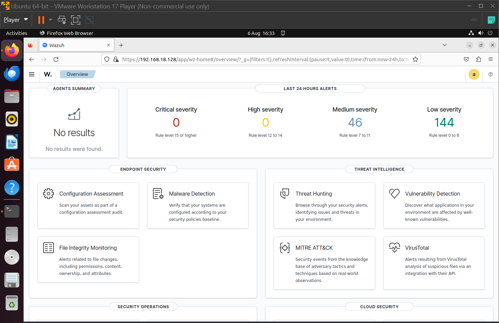

# Phase 2: Wazuh + Elastic Stack Installation

## Overview
Wazuh (manager, indexer, and dashboard) was deployed on the Ubuntu SOC server VM using Wazuh's official Docker Compose single-node configuration, which bundles all three components together.

## Steps

1. Cloned the official Wazuh Docker repository (v4.9.0):
```bash
   git clone https://github.com/wazuh/wazuh-docker.git -b v4.9.0
   cd wazuh-docker/single-node
```

2. Applied a required kernel parameter for the OpenSearch-based indexer to run reliably:
```bash
   sudo sysctl -w vm.max_map_count=262144
   echo "vm.max_map_count=262144" | sudo tee -a /etc/sysctl.conf
```

3. Launched the stack:
```bash
   docker compose up -d
```

   This deploys three containers:
   - `wazuh.manager` — core detection engine, rule evaluation
   - `wazuh.indexer` — OpenSearch-based data store for events/alerts
   - `wazuh.dashboard` — web UI for visualizing alerts

## Issue encountered: dashboard crash loop (EISDIR error)

**Problem**: The first deployment attempt ran out of disk space mid-download (see `01-environment-setup.md`). After the disk was expanded and the stack relaunched, the dashboard container repeatedly crashed with:
```
Error: EISDIR: illegal operation on a directory, read
at readFile (.../ssl_config.js:170:31)
```
**Diagnosis**: The failed first run had left behind corrupted, partially-written SSL certificate files. Regenerating certificates via Wazuh's cert generator produced `cp: cannot overwrite directory` errors, confirming the destination certificate directory itself was corrupted (a leftover from the failed run — not cleaned up by `docker compose down -v` since it lives on the host filesystem, not in a Docker-managed volume).

**Fix**:
1. Tore down all containers and named volumes:
```bash
   docker compose down -v
```
2. Manually deleted the corrupted certificate directory:
```bash
   sudo rm -rf config/wazuh_indexer_ssl_certs
```
3. Regenerated certificates cleanly:
```bash
   docker compose -f generate-indexer-certs.yml run --rm generator
```
4. Relaunched the stack:
```bash
   docker compose up -d
```

**Result**: All three containers started cleanly. `docker logs` on the dashboard container showed a small number of expected `ECONNREFUSED` errors during the first few seconds (the dashboard starting slightly before the indexer was ready), which self-resolved once the indexer finished booting — followed by successful plugin initialization and no fatal errors.

## Accessing the dashboard

- URL: `https://<SOC-server-VM-IP>` (e.g. `https://192.168.18.128`)
- Uses a self-signed certificate — browsers will show a security warning on first visit. This is expected in a lab environment; a production deployment would use a CA-signed certificate.
- Login credentials are defined in `docker-compose.yml` under `INDEXER_PASSWORD`:
  - Username: `admin`
  - Password: *(set in `docker-compose.yml` — rotate before any real deployment, do not reuse lab defaults)*

## Verification
```bash
docker ps
```
Confirmed all three containers (`wazuh.manager`, `wazuh.indexer`, `wazuh.dashboard`) showing `Up` status, then successfully logged into the dashboard.

## Screenshots
- [ ] `docker ps` showing all three containers healthy
- [ ] Wazuh dashboard login page
- [ ] Wazuh dashboard home screen after successful login

- [ ] 
